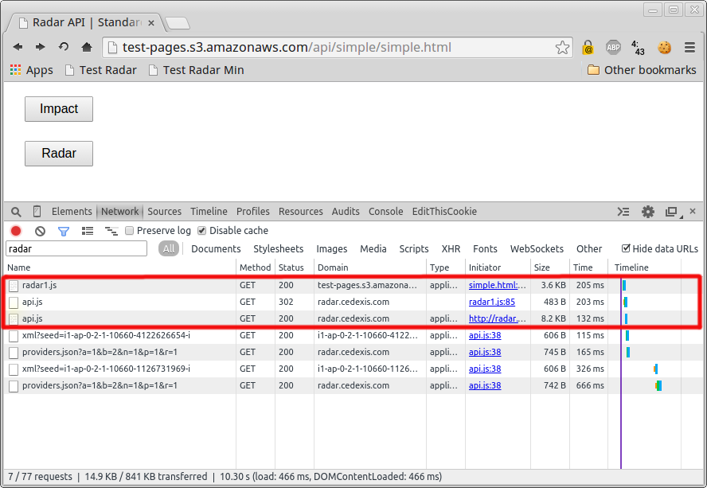

# Radar JavaScript API

As an alternative the mainstream Cedexis Radar client, this library gives site
admins and developers greater control over the timing and nature of Radar and
Impact sessions.  It is geared mainly for use in web applications featuring a
single page interface, where multiple user actions can take place within the
context of a single page view over the course of several minutes.

The basic process is:

1. Add the bootstrap JavaScript snippet to your site.
2. Write code to trigger Radar and Impact events.

We'll describe this process in detail below.

## Reference Test Page

In this document we refer to illustrations and code listings taken from a simple
test, which you encouraged to examine.  It is available at
http://test-pages.s3.amazonaws.com/api/simple/simple.html.

## Bootstrap Snippet

This repository contains both [minified](./js/radar1.min.js) and
[unminified](./js/radar1.js) versions of the bootstrap snippet.

The best way to integrate this snippet into your site is to host one of these
files along with your other static assets and then reference it as an external
script from within your page anywhere before other scripts that use the library.
For example, suppose that:

1. You host your JavaScript on assets.foo.com a directory called `js`.
2. Your own site JavaScript lives in a file called site.js.  From this file
   you'll need access to the API provided by the bootstap snippet.

Then in your HTML, you add a link to the Radar bootstap file above the link to
site.js like this:

```html
<!DOCTYPE html>
<html>
<head>
    <title>Your Site Title</title>
</head>
<body>
    <!-- Your other markup -->

    <script src="//assets.foo.com/js/radar1.min.js"></script>
    <script src="//assets.foo.com/js/site.js"></script>
</body>
</html>
```

The bootstrap snippet should very rarely change, so for best performance you can
safely specify headers allowing it to be cached indefinitely by the browser and
intermediate caches (two weeks is a suggested minimum timeframe).  We include a
version number in the filename to help manage any changes that may come about in
the future.

Alternatively, you could simply include the content of the bootstrap JavaScript
file as an inline script in your HTML.  The main drawback of this approach is
that it increases the size of your page by about 1&nbsp;KB (the approximate size of
the minified bootstrap file).

**What to expect when the page loads**

The role of the bootstrap code is to create some stub functions and then
initiate the download of the actual Radar JS API code from radar.cedexis.com,
which it does from an onload event handler.  You can see these downloads
outlined in red in the image below.



The initial request to http://radar.cedexis.com/radar/api.js redirects to a
fingerprinted URL such as
http://radar.cedexis.com/radar/1429903024/QoGi4hp3JDoU5pP4vzR9wne0neW6NqA0/api.js.
The redirect response is set to be cacheable for about an hour, while the final
resource is set to be cacheable for two weeks, so visitors will usually not have
to download it again on subsequent visits.

Once the api.js file is downloaded and executed, the stubs created by the
bootstrap snippet will have been replaced (monkey patched) by real versions from
the API.  This allows your site code to make calls to the API before it is
actually available without breaking.  These calls are simply placed in a queue
and should begin to execute as soon as the API becomes available.  From your
point of view, this transition should be completely seamless.  You need only be
concerned with how your site functions and at what points you would like to make
a Radar API call, not whether the API is actually ready to accept calls.

The use of bootstrap code to generate stubs, downloading the actual API code
from the window onload event, and making that code highly cacheable is meant to
ensure that the client library rests as lightly on your site and is as easy to
use as possible.

## API Reference

### cedexis.api.create()

#### Summary

The cedexis.api.create function creates and returns a RadarApi object.

#### Syntax

cedexis.api.create(settings)

#### Parameters

**settings**

A JavaScript object having the following properties:

| Name | Description |
| ---- | ------------|
| zoneId | blah |
| customerId | blah |
| cookieDomain | blah |
| cookiePath | blah |
| site | blah |

#### Description

The RadarApi object returned by cedexis.api.create() bears methods used to
invoke Radar sessions and report Impact events.  This should be stored and
reused throughout the life of the web application.

#### Examples

### RadarApi.prototype.radar()

#### Summary

#### Syntax

#### Description

#### Examples

### RadarApi.prototype.impact()

#### Summary

#### Syntax

#### Description

#### Examples

## Further Examples

Perform a Radar session when the page loads and then again once per minute.
Also instruct the client to clear and extend the cache of Resource Timing
data made available by the browser (jQuery):

```javascript
$(function() {
    var api = cedexis.api.create({
        zoneId: 1,
        customerId: 10660
    });

    function doRadarSession() {
        api.radar({
            clearResourceTimings: true,
            resourceTimingBufferSize: 300
        });
        setTimeout(doRadarSession, 60000);
    }

    doRadarSession();
});
```
